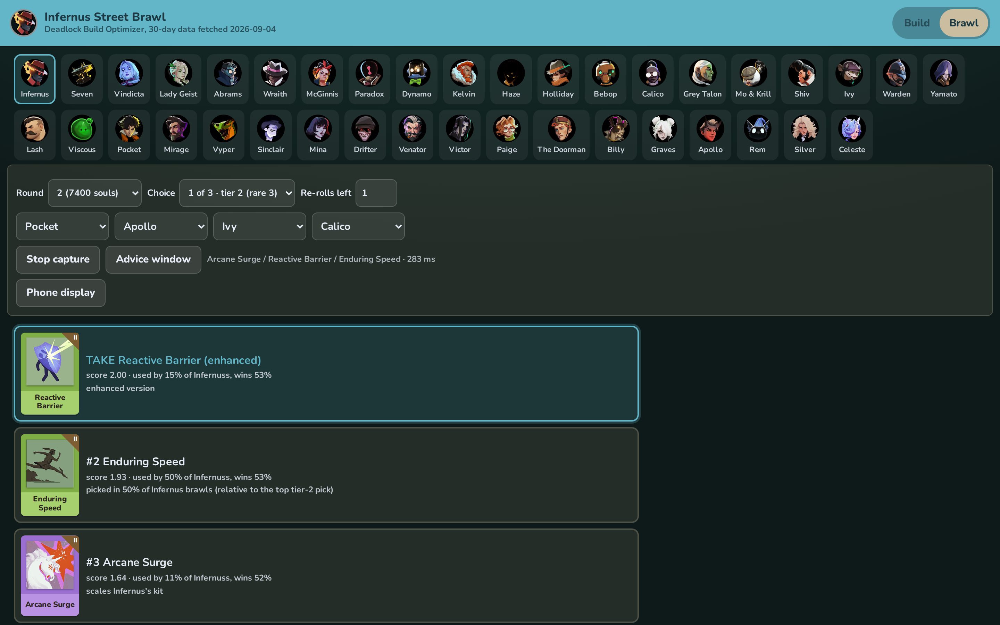

# Deadlock Street Brawl Helper 🥊

<p align="center">
  
</p>

A draft advisor for [Deadlock](https://store.steampowered.com/app/1422450/Deadlock/)'s Street Brawl
mode. It reads the draft screen while you play, ranks the three cards you're being offered, and tells
you whether the set is worth a re-roll. The advice shows up in a small window on top of the game.
Scores come from 30 days of Street Brawl matches from [deadlock-api.com](https://deadlock-api.com).

## Quickstart 🚀

Requires [Node.js](https://nodejs.org) 20 or newer, and Chrome or Edge. The match data is already in
the repo, and refreshes weekly on its own.

```
git clone https://github.com/Gidntsquia/deadlock-street-brawl-helper
cd deadlock-street-brawl-helper
npm install
npm run dev   # Open http://localhost:5173 and leave this running
```

Then, with Deadlock open:

1. In Deadlock's settings, under Video, set Display Mode to **Borderless Windowed**. The overlay
   can't sit on top of the game in fullscreen.
2. In the app, click **Capture game screen + overlay** and pick the Deadlock window from the list.
3. Play a Street Brawl draft. The advice window follows the draft on its own.

The header shows how old the snapshot is ("N days old", flagged once it passes 14 days).

IMPORTANT: Firefox can't open always-on-top windows, so this only works in Chrome or Edge. Press
Ctrl+C in the terminal to stop the app.

Other commands:

```
npm run brawl -- --hero 1 --round 2 --owned "Extra Charge" --enemies "Lash,Seven" \
    --set "Improved Spirit,Enchanter's Emblem,Swift Striker"   # Advice without the screen reader
npm run fetch-data                       # Refresh the 30-day snapshot (~1400 requests, slow)
npm run fetch-data -- --brawl-tierlist   # Rebuild the tier list from the files already on disk
npm run brawl:see -- --fixtures          # Card recogniser accuracy on the saved screenshots
```

## Windows app 🪟

A packaged Windows build skips the picker entirely and draws the highlight box straight onto the
Deadlock window, with no floating overlay window to place by hand.

```
npm run dist   # Windows only; builds release/*.exe (installer + portable)
```

Start Deadlock in borderless windowed mode, then launch the exe: capture starts on its own once the
Deadlock window is found, no picker dialog. The advice — ranked cards, RE-ROLL banner, ability order —
is drawn straight onto the game in a small always-on-top panel, so you never have to alt-tab.
Ctrl+Shift+O toggles the overlay; Ctrl+Shift+D shows it with sample advice for 10s so you can check
placement without a live draft; the tray icon also has a Quit item. If Deadlock isn't running, the app
says "Deadlock window not found" instead of capturing some other window (matched by the game's exact
window title, so the app's own window is never mistaken for it). The browser path above still works
cross-platform and needs no packaging.

## Features 🔬

- The three cards, the round, the enemy team, and the items you've already picked are all read from
  the screen. Nothing is sent to the game.
- Cards are ranked for the hero you're playing, from how often the item is picked in Street Brawl,
  its win rate there, and how well it scales that hero's abilities.
- Re-roll advice compares the best card in front of you with what a fresh set is expected to offer, shown
  as an unmissable amber banner; the on-screen box moves to the "Use Re-Roll" button instead of a card.
  A re-rolled rare or enhanced slot stays rare or enhanced, which is part of the call.
- An ability upgrade order for the hero you're playing, ranked by Street Brawl usage and win rate, with
  the step you're probably on now highlighted.
- Your hero is auto-detected from the scoreboard as soon as the draft screen is read, with an "auto"
  badge next to the name so you can see it happened; you can still pick a hero manually.
- The enemy heroes read off the scoreboard move the ranking toward items that do well against them.
- The legendary items that only appear in Street Brawl are ranked alongside everything else.
- A second tab grades every hero and every draftable item S, A, B or C from the last 30 days.
- If the capture misses a card you can pick the three yourself, and the ranking updates.
- No backend. Everything runs in the browser off the snapshot in the repo.
- Your hero, tab, round and enemy picks are remembered across reloads (stored in the browser only).
- Switching hero mid-draft (by hand or auto-detect) never interrupts the capture.

## Documentation 📚

- [Street Brawl Advisor](https://github.com/Gidntsquia/deadlock-street-brawl-helper/wiki/Street-Brawl-Advisor) — the mode's rules, the card scoring function, and the re-roll maths
- [Screen Reader](https://github.com/Gidntsquia/deadlock-street-brawl-helper/wiki/Screen-Reader) — how cards, tiers, labels and your picks are recognised
- [Overlay](https://github.com/Gidntsquia/deadlock-street-brawl-helper/wiki/Overlay) — screen capture and the always-on-top window
- [Tier List](https://github.com/Gidntsquia/deadlock-street-brawl-helper/wiki/Tier-List) — how the S/A/B/C grades are worked out
- [Data Pipeline](https://github.com/Gidntsquia/deadlock-street-brawl-helper/wiki/Data-Pipeline) — what `fetch-data` downloads, and the 30-day window
- [Development](https://github.com/Gidntsquia/deadlock-street-brawl-helper/wiki/Development) — code layout, scripts, checks

## License 📄

[MIT](LICENSE). Match data and item art come from [deadlock-api.com](https://deadlock-api.com);
Deadlock is Valve's.
