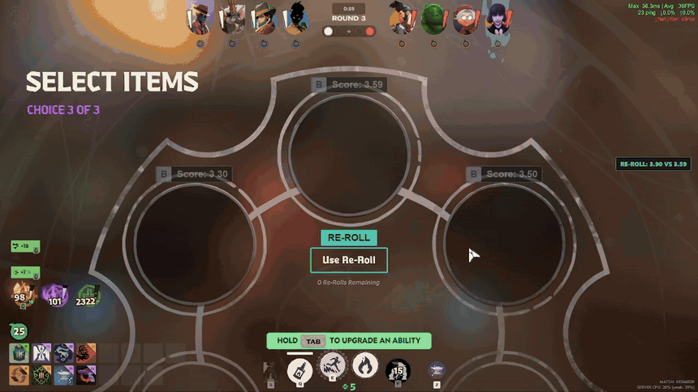

# Deadlock Street Brawl Helper 🃏

<p align="center">
  
</p>

A draft advisor for [Deadlock](https://store.steampowered.com/app/1422450/Deadlock/)'s Street Brawl mode. It reads the draft screen while you play, ranks the three cards you're offered, and says whether the set is worth a re-roll. The advice is drawn over the draft screen. Scores are built from 30 days of Street Brawl matches from [deadlock-api.com](https://deadlock-api.com).

## Quickstart 🚀

Requires Windows. Get the app from the [latest release](https://github.com/Gidntsquia/deadlock-street-brawl-helper/releases/latest): a portable `.exe` and an installer.

1. In Deadlock's Video settings, set Display Mode to Borderless Windowed.
2. Run the app. It finds the Deadlock window on its own.
3. Play a Street Brawl draft. The advice shows up over the draft screen.

IMPORTANT: the files aren't code-signed, so Windows SmartScreen will warn you. Click More info, then Run anyway.

Press F8 to read the draft right away if the app hasn't picked it up. With no game running, press Ctrl+Shift+D and turn on Test mode to try the overlay on a real draft screenshot.

To work on it (needs [Node.js](https://nodejs.org) 20 or newer):

```
npm install
npm run dev                        # Browser version, for development only
npm run brawl -- --hero 1 --round 2 --set "Improved Spirit,Enchanter's Emblem,Swift Striker"   # Advice without the screen reader
npm run fetch-data                 # Refreshes the 30-day snapshot (~1400 requests, ~9 min)
npm run win:dev                    # From WSL: runs the Windows app from a synced copy
npm run win:e2e -- --slow 4        # From WSL: end-to-end check with the CPU throttled 4x (advice must still land within 2.5 s)
```

## Features 🔬

- Reads the three cards, the round, the enemy team and the items you've already picked from the screen. Nothing is sent to the game.
- Ranks the cards for your hero using pick rate, win rate and how well each item scales that hero's abilities.
- Detects your hero from the scoreboard, and you can change it by hand.
- Shifts the ranking toward items that do well against the enemy heroes.
- Says when a re-roll is the better call and moves the box to the Use Re-Roll button.
- Ranks the Street Brawl legendary items with everything else.
- Shows an ability upgrade order for your hero, and a picture of the ability points panel for about 15 seconds after the draft closes. You can set your own order per hero.
- Grades every hero and draftable item S, A, B or C on a second tab.
- Has a test mode that opens a dummy Deadlock window with a real draft screenshot.
- Release candidates (`-rc`) record your last 3 matches locally so a misread can be replayed.

## Documentation 📚

More details in the
[wiki](https://github.com/Gidntsquia/deadlock-street-brawl-helper/wiki):

- [Street Brawl Advisor](https://github.com/Gidntsquia/deadlock-street-brawl-helper/wiki/Street-Brawl-Advisor) — the mode's rules, card scoring, re-roll maths
- [Screen Reader](https://github.com/Gidntsquia/deadlock-street-brawl-helper/wiki/Screen-Reader) — how cards, tiers, labels and your picks are recognised
- [Overlay](https://github.com/Gidntsquia/deadlock-street-brawl-helper/wiki/Overlay) — screen capture and the always-on-top window
- [Windows App](https://github.com/Gidntsquia/deadlock-street-brawl-helper/wiki/Windows-App) — the packaged app, test mode, developing from WSL
- [Tier List](https://github.com/Gidntsquia/deadlock-street-brawl-helper/wiki/Tier-List) — how the S/A/B/C grades are worked out
- [Data Pipeline](https://github.com/Gidntsquia/deadlock-street-brawl-helper/wiki/Data-Pipeline) — what `fetch-data` downloads, and the 30-day window
- [Development](https://github.com/Gidntsquia/deadlock-street-brawl-helper/wiki/Development) — code layout, scripts, checks

## License 📄

[MIT](LICENSE). Match data and item art come from [deadlock-api.com](https://deadlock-api.com);
Deadlock is Valve's.
