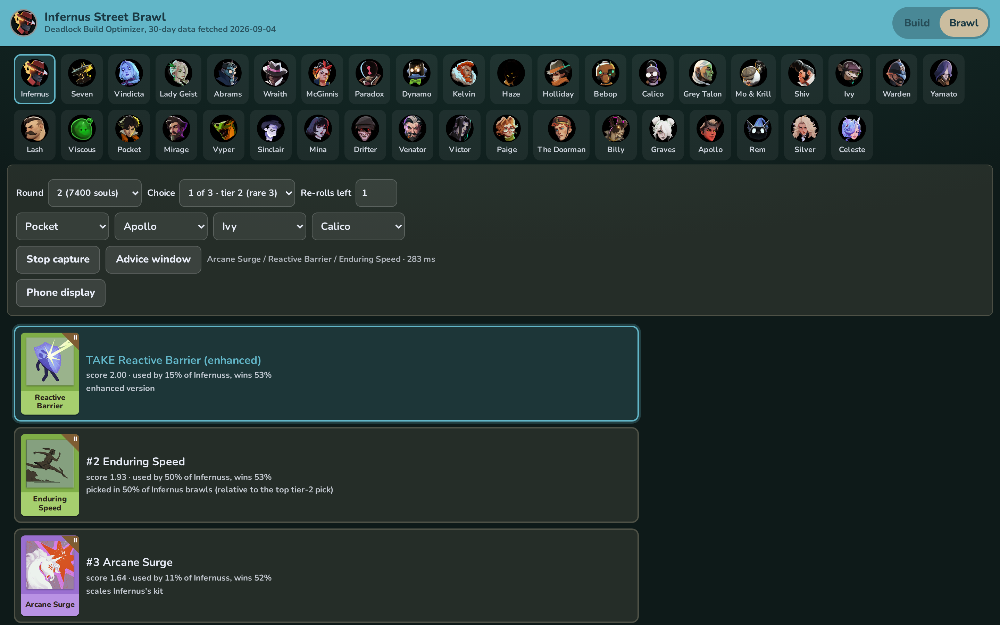

# Deadlock Street Brawl Helper

<p align="center">
  
</p>

A draft advisor for [Deadlock](https://store.steampowered.com/app/1422450/Deadlock/)'s Street Brawl
mode. It reads the draft screen while you play, ranks the three cards you're offered, and says whether
the set is worth a re-roll. The advice shows up directly over the draft screen. Scores are built
from 30 days of Street Brawl matches from [deadlock-api.com](https://deadlock-api.com).

## Download

Get the Windows app from the [latest Release](https://github.com/Gidntsquia/deadlock-street-brawl-helper/releases/latest).
It has two files:

- `Deadlock Street Brawl Helper <version>.exe`: portable, run it from anywhere.
- `Deadlock Street Brawl Helper Setup <version>.exe`: installer.

The files are not code-signed, so Windows SmartScreen will warn "Windows protected your PC". Click
**More info**, then **Run anyway**.

Then:

1. In Deadlock's settings, under Video, set Display Mode to **Borderless Windowed**.
2. Run the app. It finds the Deadlock window on its own.
3. Play a Street Brawl draft. The advice appears over the draft screen.

Quickstart:

- **F8 (Detect now)**: press it once the draft screen is up to read it right away. The app also finds the
  draft by itself; F8 is the quick way to ask. If no draft is on screen the status says `No draft found`.
- **Test mode**: no game running? Press **Ctrl+Shift+D** to open the Debug panel and turn on Test mode.
  It opens a dummy Deadlock window with a real draft screenshot so you can try the overlay.
- **Custom ability order**: open the ability order editor in the main view, pick your hero and set the
  points for each of the 12 rounds. A valid order replaces the standard one in the ability panel.
- **Release candidates (`-rc`) run with debug mode on**: the title bar shows `DEBUG`, the Debug panel
  has the session report, and the last 3 matches are recorded locally so a misread can be replayed.
  The final release has debug mode off.

The match data was last refreshed on 2026-10-07 (see `public/data/manifest.json`). To refresh it, run
`npm run fetch-data` and commit the result.

Developing (needs [Node.js](https://nodejs.org) 20 or newer):

```
npm run brawl -- --hero 1 --round 2 --set "Improved Spirit,Enchanter's Emblem,Swift Striker"   # Advice without the screen reader
npm run fetch-data                 # Refresh the 30-day snapshot (~1400 requests, ~9 min)
npm run brawl:see -- --fixtures    # Card recogniser accuracy on the saved screenshots
npm run dev                        # Browser version, for development only
npm run dist                       # Build the Windows app (run on Windows)
npm run win:dev                    # From WSL: run the Windows app from a synced copy
```

## Features

- The three cards, the round, the enemy team, and the items you've already picked are read from the
  screen. Nothing is sent to the game.
- Cards are ranked for your hero using how often each item is picked in Street Brawl, its win rate, and
  how well it scales that hero's abilities.
- Your hero is detected from the scoreboard and can be changed by hand.
- The app window is just a Start/Stop capture button and a status line; debug controls are behind Ctrl+Shift+D.
- The enemy heroes on the scoreboard shift the ranking toward items that do well against them.
- Re-roll advice compares the best card on screen with what a fresh set is expected to offer, and the
  box moves to the Use Re-Roll button when a re-roll is the better call.
- The legendary items that only appear in Street Brawl are ranked with everything else.
- An ability upgrade order for your hero, with the step you're probably on highlighted. In the Windows
  app a picture of the ability points panel shows this round's points for about 15 seconds after the
  draft closes.
- A second tab grades every hero and every draftable item S, A, B or C.
- If the capture misses a card, you can enter the three yourself.
- A test mode in the Windows app opens a dummy Deadlock window with a real draft screenshot, so you can
  try the overlay without the game running.
- There is no backend. Your hero, tab, round and enemy picks are stored in the browser only.

## Documentation

More details in the
[wiki](https://github.com/Gidntsquia/deadlock-street-brawl-helper/wiki):

- [Street Brawl Advisor](https://github.com/Gidntsquia/deadlock-street-brawl-helper/wiki/Street-Brawl-Advisor): the mode's rules, card scoring, re-roll maths
- [Screen Reader](https://github.com/Gidntsquia/deadlock-street-brawl-helper/wiki/Screen-Reader): how cards, tiers, labels and your picks are recognised
- [Overlay](https://github.com/Gidntsquia/deadlock-street-brawl-helper/wiki/Overlay): screen capture and the always-on-top window
- [Windows App](https://github.com/Gidntsquia/deadlock-street-brawl-helper/wiki/Windows-App): the packaged app, test mode, developing from WSL
- [Tier List](https://github.com/Gidntsquia/deadlock-street-brawl-helper/wiki/Tier-List): how the S/A/B/C grades are worked out
- [Data Pipeline](https://github.com/Gidntsquia/deadlock-street-brawl-helper/wiki/Data-Pipeline): what `fetch-data` downloads, and the 30-day window
- [Development](https://github.com/Gidntsquia/deadlock-street-brawl-helper/wiki/Development): code layout, scripts, checks

## License

[MIT](LICENSE). Match data and item art come from [deadlock-api.com](https://deadlock-api.com);
Deadlock is Valve's.
